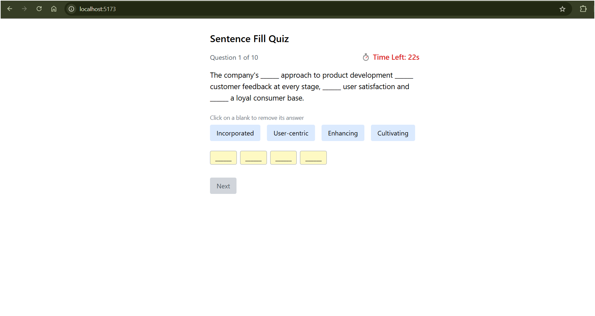
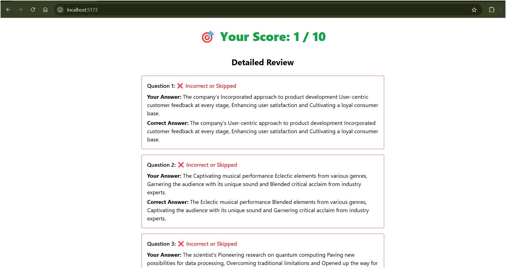

# 🧠 Sentence Builder Quiz App

An interactive, timed sentence-building quiz game that helps users practice and test their English grammar skills. Fill in the blanks by selecting the correct words — but be quick, each question only gives you 30 seconds!

---

## 🎬 Demo Preview

> A short clip showing the app in action:

<video src="src/assets/quiz-video_LeDdniQq.mp4" controls width="100%"></video>

---

## 📸 Screenshots

| Quiz View | Result View |
|-----------|-------------|
|  |  |

---

## 🚀 Features

- 🛠️ Vite + React + TypeScript frontend
- 🎨 Tailwind CSS styling
- ⌛ 30-second timer per question
- 🔄 Automatic skip on timeout
- 🧠 Fill-in-the-blanks with 4 shuffled options
- 🧼 Click to remove selected answers
- 📊 Feedback screen with score and answer comparison
- 📱 Fully responsive layout

---

## 📦 Folder Structure

